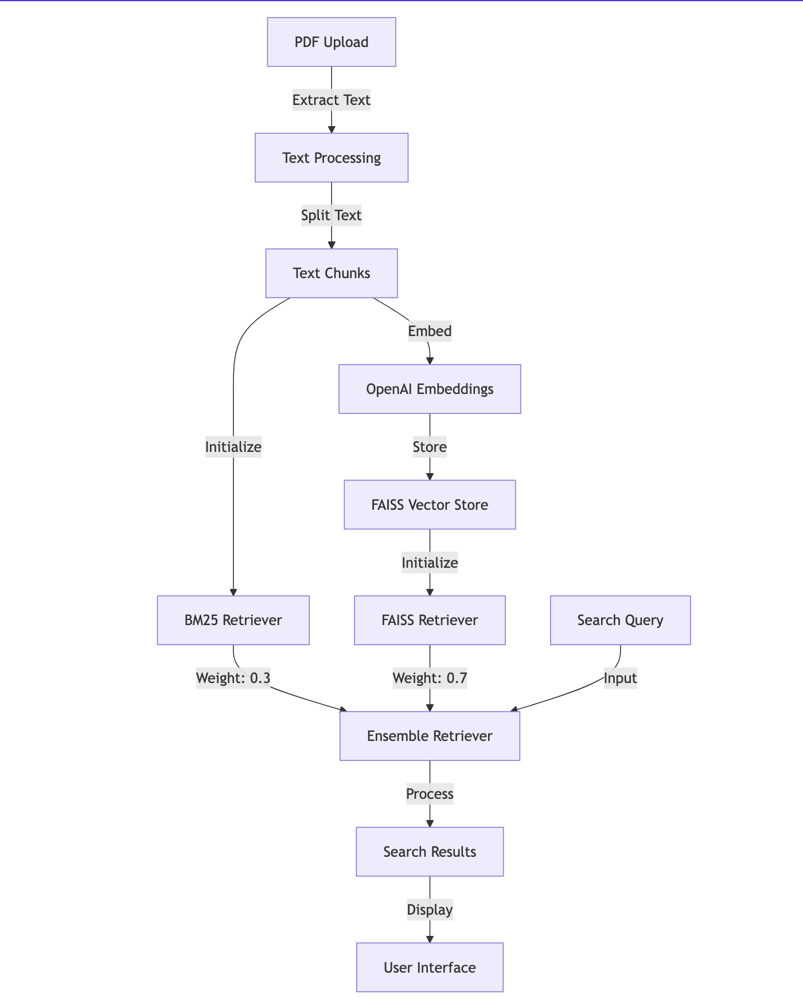
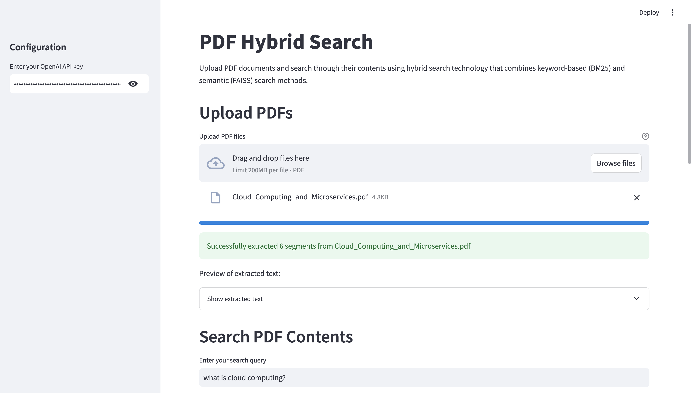

# 🔎 PDF Hybrid Search

An advanced PDF document search application that combines traditional keyword search (BM25) with modern semantic search (FAISS) capabilities to provide comprehensive and accurate search results.

## 🌟 Features

- Upload and process multiple PDF documents
- Three search methods:
  - Keyword-based search using BM25
  - Semantic search using FAISS and OpenAI embeddings
  - Hybrid search combining both methods
- Real-time text extraction and processing
- Interactive search results display
- Configurable search parameters
- Detailed result explanations

## 🏗️ Architecture



## 🚀 Getting Started

### Prerequisites

- Python 3.8 or higher
- OpenAI API key
- Required Python packages

### Installation

1. Clone the repository:

```bash
git clone https://github.com/ravix007/pdf-hybrid-search.git
cd pdf-hybrid-search
```

2. Create and activate a virtual environment:

```bash
python -m venv venv
source venv/bin/activate  # On Windows: venv\Scripts\activate
```

3. Install required packages:

```bash
pip install -r requirements.txt
```

### Running the Application

1. Start the Streamlit app:

```bash
streamlit run main.py
```

2. Open your browser and navigate to http://localhost:8501

## 📦 Project Structure

```
pdf-hybrid-search/
├── main.py              # Main application file
├── requirements.txt     # Project dependencies
├── README.md           # Project documentation
└── .gitignore          # Git ignore file
```

## 🔧 Configuration

To use the application, you need:

1. An OpenAI API key
2. Input the key in the sidebar of the application
3. Upload PDF documents to begin searching

## 📝 Requirements

Create a `requirements.txt` file with the following dependencies:

```text
streamlit
langchain
openai
PyPDF2
faiss-cpu
nltk
```

## 🎯 Usage

1. Enter your OpenAI API key in the sidebar
2. Upload one or more PDF files
3. Wait for the text extraction and processing to complete
4. Enter your search query
5. View results from all three search methods:
   - Keyword Search (BM25)
   - Semantic Search (FAISS)
   - Hybrid Search (Combined)

## 🔍 Search Methods

1. **Keyword Search (BM25)**

   - Uses traditional keyword matching
   - Best for exact matches and variations
   - Weight: 30% in hybrid search

2. **Semantic Search (FAISS)**

   - Uses AI embeddings for meaning-based search
   - Best for conceptual matches
   - Weight: 70% in hybrid search

3. **Hybrid Search**
   - Combines both methods
   - Provides balanced results
   - Configurable weights

## ⚠️ Important Notes

- Keep your OpenAI API key secure
- Large PDFs may take longer to process
- Search quality depends on text extraction quality
- API usage costs apply for OpenAI embeddings

## Screenshot of working Application


